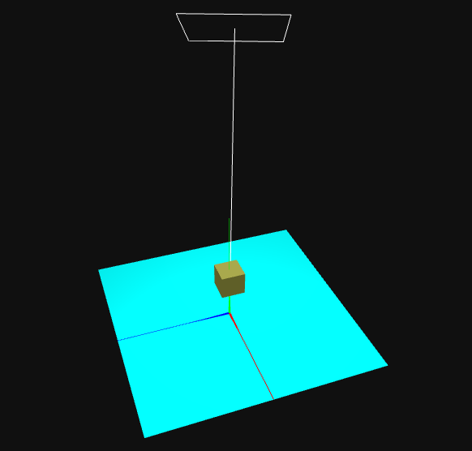
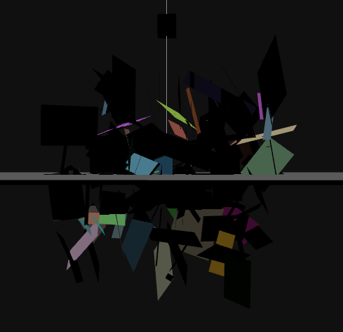

# SGI 2023/2024 - TP1

## Group: T07G07

| Name | Number | E-Mail |
| ---- | ------ | ------ |
| Diogo Fonte        | 202004175 | up202004175@edu.fe.up.pt |
| Rodrigo Figueiredo | 202005216 | up202005216@edu.fc.up.pt |

## Project information

- Strong Points
  - Flower: The flower was one of the components that required a lot of effort because, in addition to containing a stem represented by a curve, we decided to use LatheGeometry for the petals. The process of manipulating this geometry and replicating it correctly around the center of the flower was extremely laborious, but we were very pleased with the result.
  - Flower jar: Creating the flower jar was quite labor-intensive, as it required manipulating numerous points to achieve the desired result.
- Scene
  - Room with a centered table and the anniversary cake on top of a plate. Next to the cake there is a newspaper, a jar with a flower and a spring. We have two frames with our photos, a frame with a car, a window with a landscape view, a door and a lamp on top of the car frame.
  - Relative link to the scene: http://localhost/sgi-t07-g07/tp1/index.html (execute with Live Server)

## Issues/Problems

- All features proposed on the assignment are done.
- The GUI interface folder that allows to control the texture attributes gave us some trouble, and we only implemented it close to the end of the project. It is not in the textures tag, but it has been implemented and is functioning correctly.

## Final Project Result


## Project Assignment Steps

### 4.1

#### 4.1.3

- When rotating in the x-axis, the box will be tilted to the left or to the right with respect to the x-axis. Rotations of -20 degrees and 20 degrees will result in the same inclination but in opposite directions.

- By changing the order of execution of some operations, it was possible to verify that there were no differences in the final result.

### 4.2

#### 4.2.1

- Original scene:


- Changing the position of the light source from (0, 20, 0) to (0, -20, 0):


It is noticeable that the upper face of the cube and the plane, which were previously illuminated, have now become unlit and dark. Meanwhile, the lateral faces remain the same as they were not illuminated.

- Changing the light source intensity to 5 and its position to (0, 2, 0):


In this case, all faces of the cube remain unilluminated, while the plane is illuminated.

- Doing ```this.diffusePlaneColor = "rgb(0,0,0)"```


When setting the diffuse color to black, the plane becomes entirely black, and the only observable components are the specular and ambient.

- Doing ```this.planeShininess = 400```:


By increasing the shininess, the specular component becomes more intense and focused, reducing the area it covers.

- Doing:
```
this.diffusePlaneColor =  "rgb(128,128,128)"
this.specularPlaneColor = "rgb(0,0,0)"
this.planeShininess = 0
...

pointLight = new THREE.PointLight(0xffffff, 5, 0, 0);
pointLight.position.set( 0, 20, 0 );
```


- Changing the light to ```pointLight = new THREE.PointLight(0xffffff, 5, 15, 0)```


The maximum range of the light was set to 0, which means there was no limit, and the light can illuminate to infinity. However, when you set the maximum range to 15, which is less than the distance from the light to the plane, the plane will no longer be illuminated.

- Restoring the maximum range to 0 and varying the decay:
  - Decay = 0:


  - Decay = 1:


  - Decay = 2:


The higher the decay, the more the light darkens along the distance, as can be seen in the images above. With a higher decay, the plane becomes darker.

#### Directional Light

- Changing the intensity of the light:

- ```const light2 = new THREE.DirectionalLight( 0xffffff, 1 );```


- ```const light2 = new THREE.DirectionalLight( 0xffffff, 2 );```


- ```const light2 = new THREE.DirectionalLight( 0xffffff, 5 );```


The result of changing the light intensity is quite visible, with the plane becoming more illuminated as the intensity increases.

- Changing the position of the light:

```
const light2 = new THREE.DirectionalLight( 0xffffff, 1 );
light2.position.set(5, 10, 2); 
```


By changing the position of the light, considering that the default target is (0,0,0), the light reflection ray will go in the opposite direction to the light incidence ray. As shown in the images above, depending on the observer's position, it may be possible to see the plane more or less illuminated.

- Changing the position to the other side:

```
const light2 = new THREE.DirectionalLight( 0xffffff, 1 );
light2.position.set(-5, 10, -2);
```




When placing the light on the other side, the results will ultimately be the same, only the direction of the reflection ray changes. However, it is still possible to observe the difference in plane illumination depending on the observer's position.

- It is also possible to change the target, as it can be shown by the light helper:


#### Spot Light

- Original scene:


- Changing angle to 35º:


It is clearly visible in the helper that the angle decreases as the cone becomes narrower.

- Changing the penumbra:
  - Penumbra = 0.2:

  

  - Penumbra = 0.7:

  

  - Penumbra = 1.0:

  

It is possible to observe that as the penumbra increases, the percent of the spotlight cone that is attenuated also increases.

### 4.3

#### 4.3.6


The difference lies in the material used. The first option uses MeshPhongMaterial, and the second option uses MeshLambertMaterial. The main difference between the two materials is in the lighting components they support. With the Phong material, you can obtain ambient, diffuse, and specular components, while with the Lambert material, it's impossible to represent the specular component.

#### Cube with texture


### 4.4

#### 4.4.11 - Polyline


#### 4.4.12 - Quadratic Bezier Curve


#### 4.4.13 - Cubic Bezier Curve


#### 4.4.14 - Catmull Rom Curve


### 4.6

#### 4.6.17

By reducing the resolution, both shadows have lower quality.

#### 4.6.18


In the first figure, it can be observed that there are shadows cast by some rectangles onto others and onto the ground, created by the rectangles positioned between the ground and the light source. However, in the second figure, it is noticeable that the plane does not cast shadows on the rectangles located below it.

In the third figure, with the inverted plane, shadows are cast on the rectangles located below the plane. However, the ground is no longer visible from above, and it is completely dark underneath.

It can be concluded that only the visible part of the plane casts shadows.

- Using a box:


Using a box solves the problem, as it creates shadows projected onto the ground and shadows cast by the ground on the rectangles located below it.

#### 4.6.19

- shadow.camera.left / right / bottom / top at -15, 15, -15 and 15 respectively:


- shadow.camera.left / right / bottom / top at -3, 3, -3 and 3 respectively:


The shadow.camera.left / right / bottom / top are properties related to the camera configuration used to render the shadow map in a 3D scene. By reducing these values, the area covered by the shadows becomes smaller, which can be seen in the second figure, where there are fewer shadows.

- shadow.camera.far = 27



By reducing this value, the maximum distance covered by the shadow also becomes smaller, and as it can be seen above, the shadows stop at a certain depth, that matches the value of 27.

#### 4.6.20

With the addition of this light, new distinguishable shadows are introduced. However, the behavior related to inverting the plane and using the box remains the same.

#### 4.6.21

- Without the point light:
  - 250: 60 fps
  - 800: 40 fps
  - 1750: 20 fps

- With the point light:
  - 250: 30 fps
  - 750: 25 fps
  - 1250: 20 fps