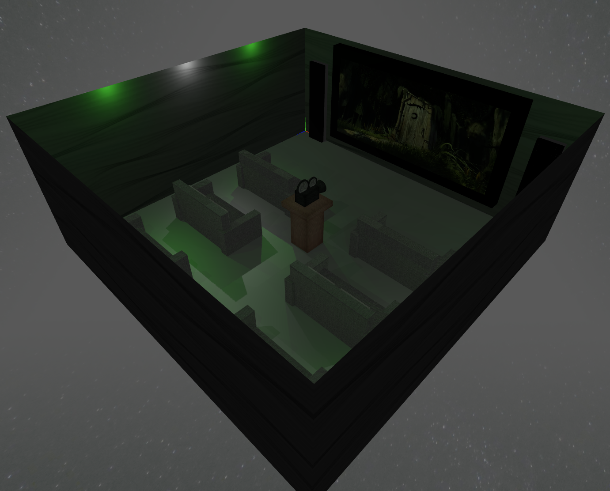
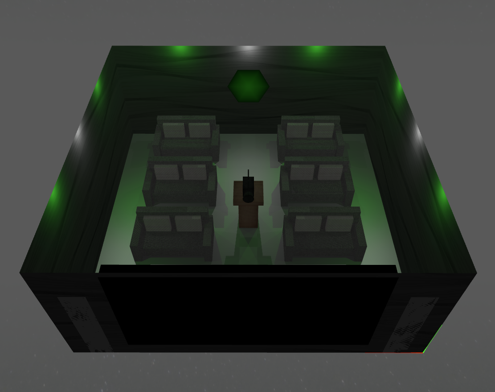
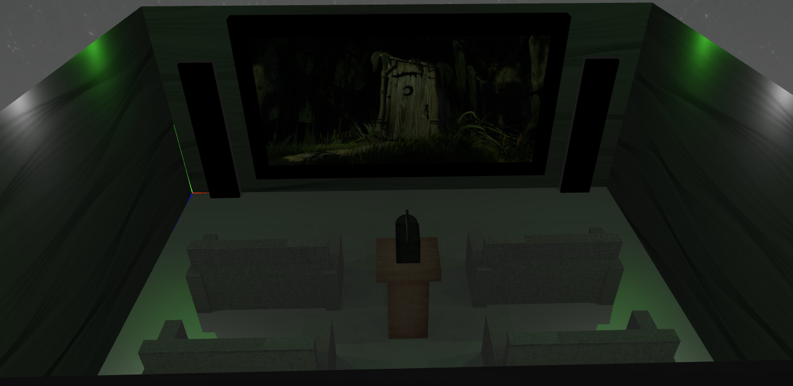
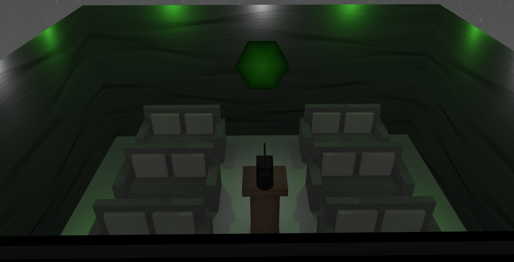
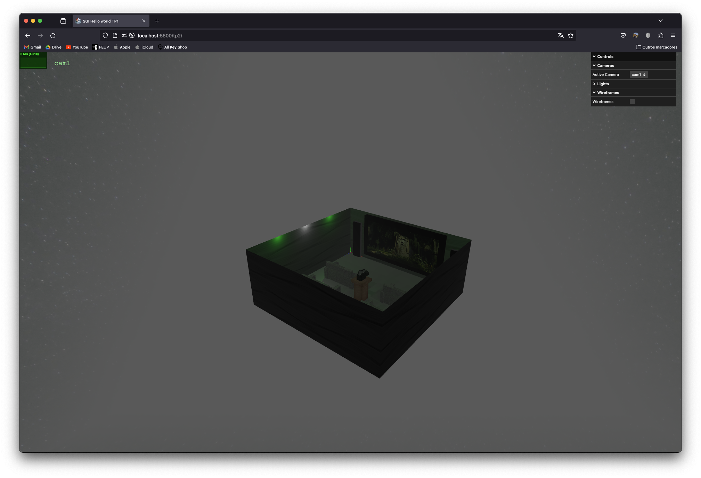

# SGI 2023/2024 - TP2

## Group: T07G07

| Name | Number | E-Mail |
| ---- | ------ | ------ |
| Diogo Fonte        | 202004175 | up202004175@edu.fe.up.pt |
| Rodrigo Figueiredo | 202005216 | up202005216@edu.fc.up.pt |

## Project information

- Strong Points
  - Scene Graph: Our scene graph has a good level of complexity, explores the concepts of transformations, hierarchy and property inherance. It also implements every functionality that made sense in the context of our scene.
  - Cinema screen with video: The theme of our project is "Vintage Cinema" so we needed to have a video for our cinema screen. It's correctly implemented, and apart from displaying the video it also has sound.
  - Buffer Geometry: The buffer geometry was the hardest primitive to implement and we took some time to really understand what we needed to do and how we could transfer our idea to code. After some time we managed to get it right and the buffer geometry is correctly implemented and totally configurable. We used the polygon primitive to add a prop to one of the walls of the cinema.
  - Interface: We implemented an interface where it's possible to change the active camera, turn on/off every light present at the scene and make the objects that use a wireframe change between wireframe and solid.
- Scene
  - The scene consists of a vintage cinema that contains 6 sofas with 2 pillows each, a stand for the projector in the middle of the room, a projector with an antique design, two speakers that make use of wireframes, and a screen where the movie is being displayed, that contains a video texture. The room also features some LEDs to ensure better lighting, and projecting shadows to the present objects. For the sofas we use MipMaps textures in order to use less computational resources when we increase the distance from them. There's also a skybox present at the scene with some "space" textures in order to provide more imersion in the movie. We also added a prop to one of the walls that uses a buffer geometry. Finally, there's an interface where it's possible to change the active camera, turn on/off every light present at the scene and make the objects that use a wireframe change between wireframe and solid.
  - Relative link to the scene: http://localhost/sgi-t07-g07/tp2/index.html (execute with Live Server)

## Issues/Problems

- LOD's weren't implemented duo to lack of time
- Small problem when apllying textures, as some of them get stretched

## Final Project Result

