# SGI 2023/2024 - TP3

## Group: T07G07

| Name | Number | E-Mail |
| ---- | ------ | ------ |
| Diogo Fonte        | 202004175 | up202004175@edu.fe.up.pt |
| Rodrigo Figueiredo | 202005216 | up202005216@edu.fc.up.pt |

----
## Project information

### Strong Points
  - Vehicle: We are very proud of our vehicle since it's very detailed and it resembles a lot a Formula 1 car, and that was exactly our objective. We took a lot of time since it is composed by a lot of different components but it was worth it and we couldn't be happier with the result.

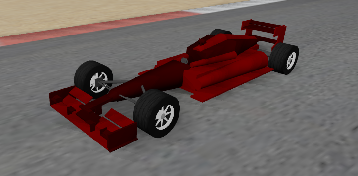
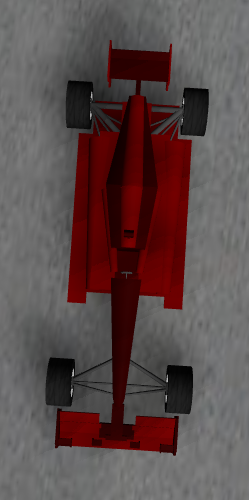
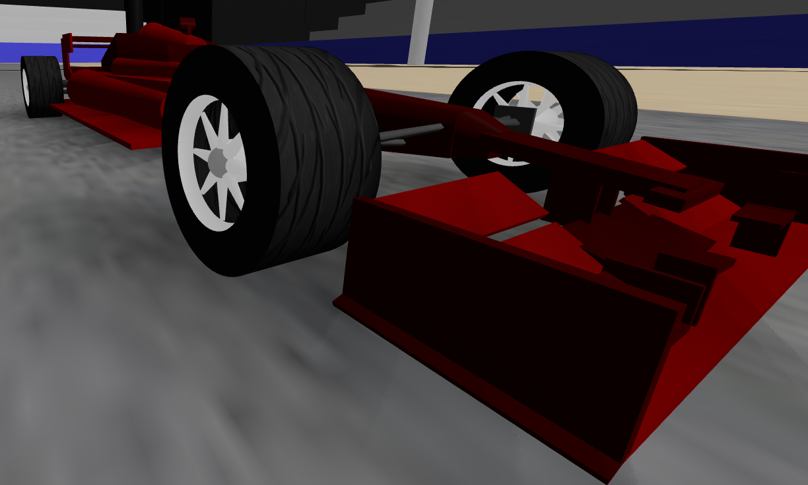

  - Outdoor Display: Our outdoor display shows all the needed information, and is correctly updated when some information is changed. It also deals well with different game states, always displaying the correct elapsed time.

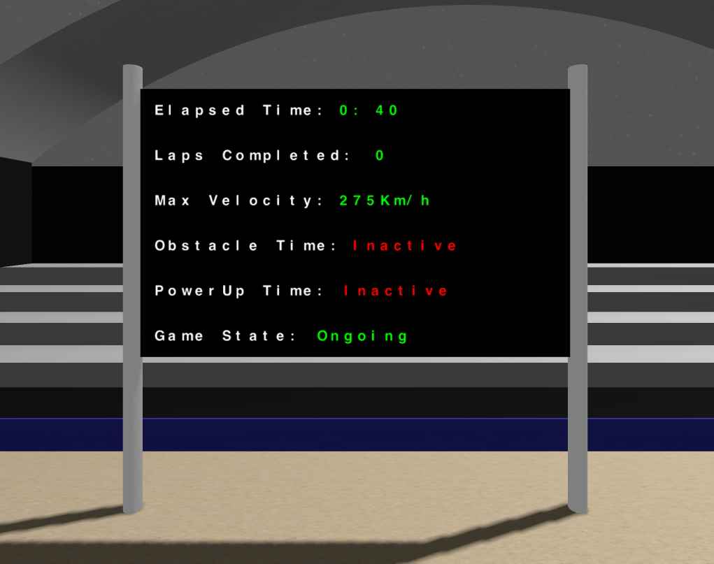

  - Menus: Our menus, including the initial and final one, were made with great detail and we made sure that apart from working they were visually appealing. All buttons represent different functionalities, and every single one of them works, including changing game difficulty, changing player name, etc.

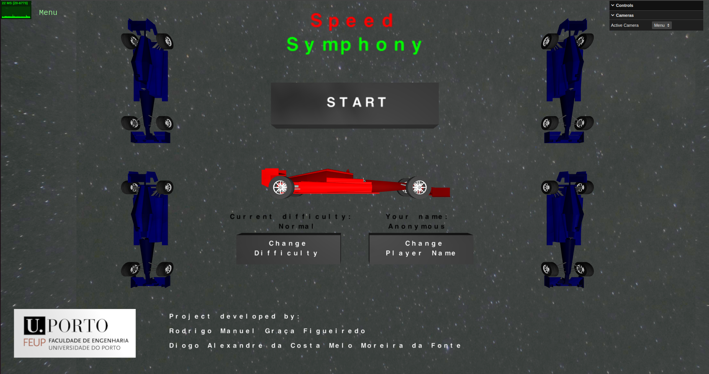
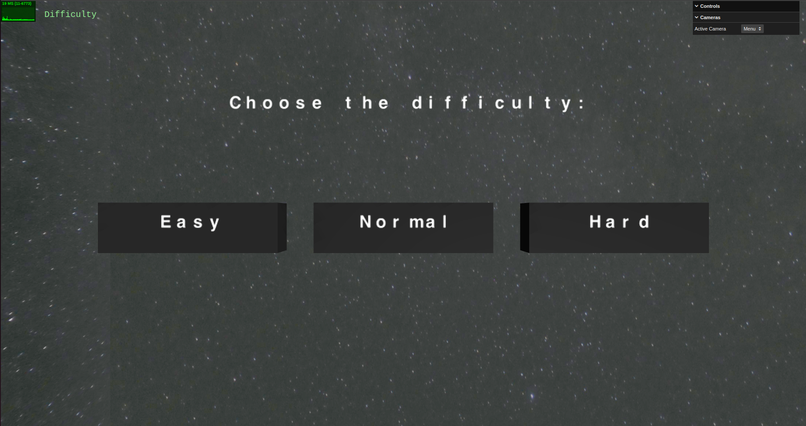
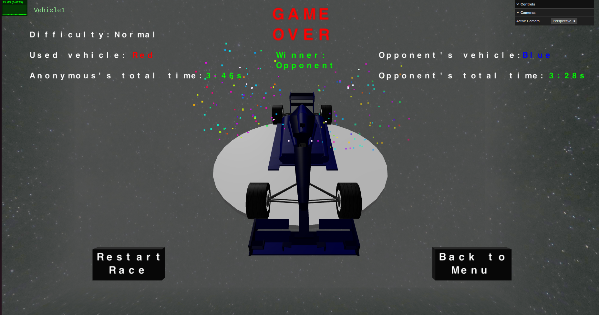

  - Parkings: In our opinion the parks are visually appealing and we used different techniques in a successful way, including picking, and also presented valuable information to the user, like what vehicle he picked for him and for his opponent, with the option of deselecting the vehicle he first picked in order to choose another one. For the vehicles park there is also a countdown before the race starts.

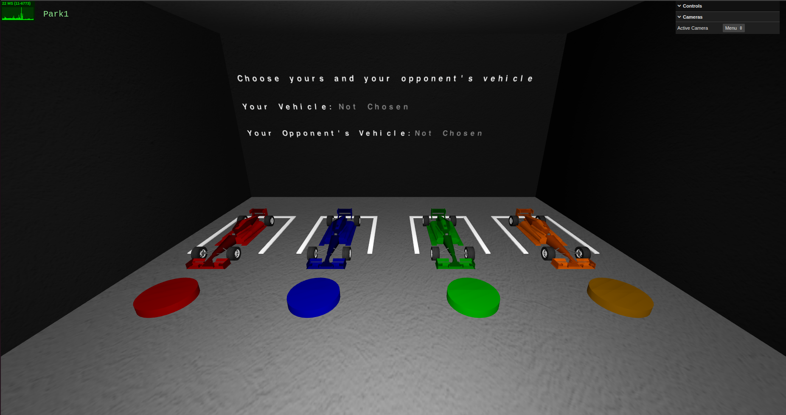
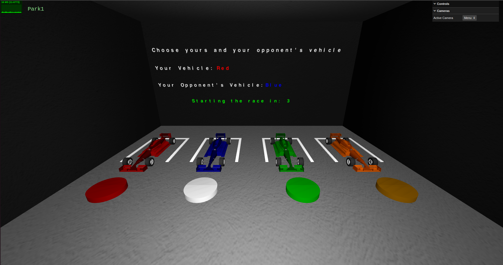
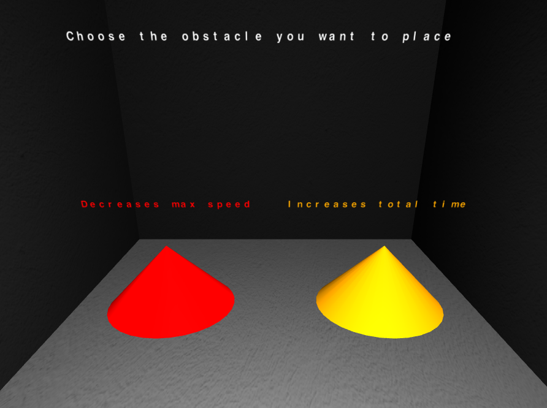

  - YASF language: We made use of the YASF language for this pratical work in order to build some components of our scene in a faster way.
  
### Scene
  - The scene for when the game is in execution consists in a gray track with red/white borders on the top of a clay ground, inserted in a large stadium with stands for the public to watch the races. It also has a large outdoor that displays the race informations, like elapsed time, completed laps, game state and remaining time of power-ups or obstacles consequences.
  - In the initial state the scene contains a menu with a "Start" button, in order to start the game, and buttons to change the game difficulty and the player name. In the final state the scene contains a menu with information related to the game and two buttons where it's possible to restart the game or go back to the menu.
  - Relative link to the scene: http://localhost/sgi-t07-g07/tp3 (execute with Live Server)

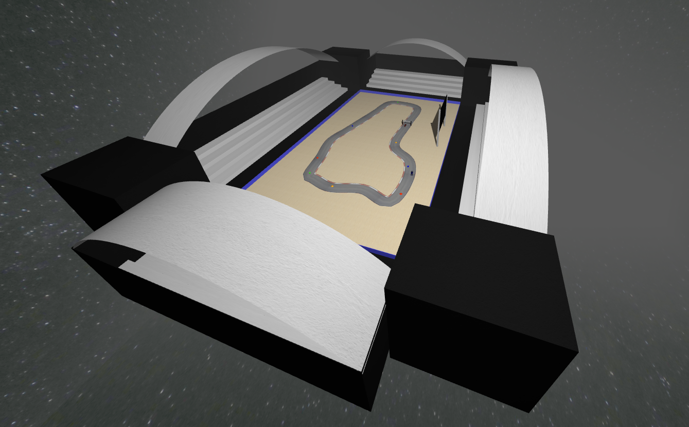
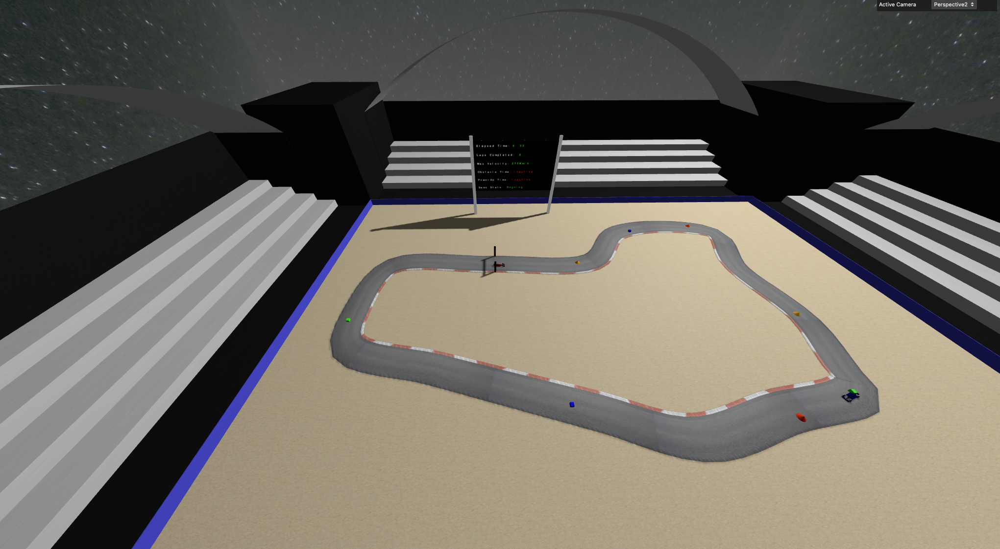
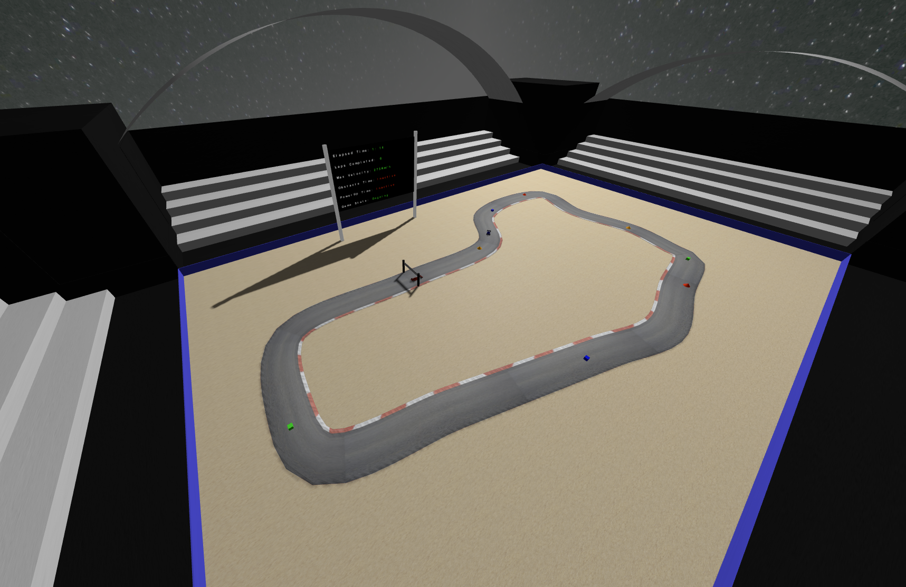
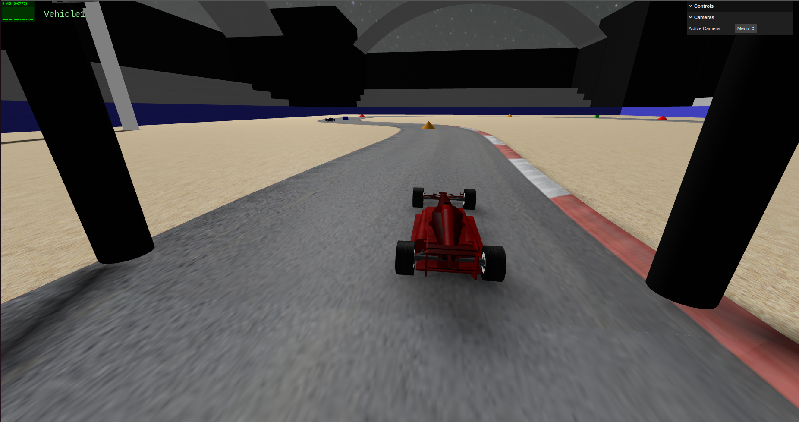

## Issues/Problems

- Section 4.5 (Shaders) wasn't implemented duo to lack of time.
- The fireworks aren't exploding with a radial movement.
- The wheels of both vehicles aren't spinning and the wheels of the opponent's vehicle don't turn.